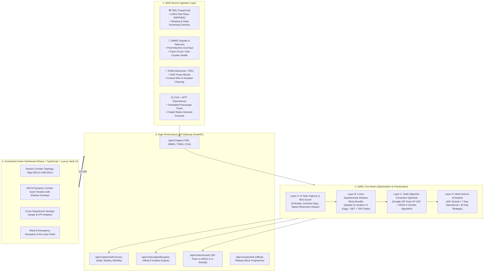

# 🚂 SIH26027: AI-Powered Automatic Block Planning System for Indian Railways
## Comprehensive Technical Implementation & Architecture Plan

---

## 🎯 Executive Summary & Problem Context

In Indian Railways, **Engineering (Track/Civil)**, **Signal & Telecommunication (S&T)**, and **Traction Distribution (TRD/Electrical)** maintain separate legacy systems:
* **TMS (Track Management System)**: Rails, sleepers, ballast, USFD flaws (IMR/OBS), tamping.
* **SMMS (Signalling Maintenance System)**: Points & crossings, track circuits, axle counters, signals.
* **TDMS (Traction Distribution System)**: Overhead Equipment (OHE), power blocks, neutral sections.
* **COA (Control Office Application)**: Train schedules, section headways, goods train forecasts.

Currently, block requests are submitted independently via **BDMS** in silos. This leads to:
1. **Excessive Asset Downtime**: Multiple separate track closures for different departments on the same section.
2. **Train Operations Disruption**: Loss of punctuality and section throughput.
3. **Suboptimal Defect Resolution**: High-criticality safety defects waiting for manual coordination.

**Our Solution (RAIL-SYNAPSE AI)**: An intelligent multi-objective optimization platform that integrates TMS, SMMS, TDMS, and COA, scores defect urgency with ML, and automatically computes **synchronized "Shadow Blocks"** (joint cross-departmental maintenance windows) across **Daily (24h)**, **Weekly (7d)**, and **Monthly (30d)** horizons.

---

## 🏛️ System Architecture & Data Flow



---

## 🧮 Mathematical Model & Optimization Formulation

The scheduling problem is formulated as a **Multi-Objective Mixed Integer Constrained Optimization Problem**:

### 1. Decision Variables
* $x_{m, s, t} \in \{0, 1\}$: Task $m$ assigned to track section $s$ during time interval $t = [t_{\text{start}}, t_{\text{end}}]$.
* $y_{b, s, t} \in \{0, 1\}$: Bundled Shadow Block $b$ active on section $s$ during interval $t$.
* $\delta_i \ge 0$: Schedule delay (in minutes) for timetabled train $i$.

### 2. Multi-Objective Objective Function

$$\min \mathcal{Z} = w_1 \cdot \text{TrainDisruptionCost} + w_2 \cdot \text{UnscheduledRiskPenalty} - w_3 \cdot \text{ShadowBundlingBonus} - w_4 \cdot \text{PunctualityIndex}$$

Where:
$$\text{TrainDisruptionCost} = \sum_{i \in \text{Trains}} \left( \text{PriorityWeight}(i) \cdot \delta_i \right)$$
$$\text{UnscheduledRiskPenalty} = \sum_{m \in \text{Tasks}} \left( \text{UrgencyScore}(m) \cdot (1 - \sum_{t} x_{m, s, t}) + \text{OverdueDays}(m) \cdot \beta \right)$$
$$\text{ShadowBundlingBonus} = \sum_{b \in \text{Blocks}} \left( \text{DeptsCount}(b) \times \text{DurationSaved}(b) \times \gamma \right)$$

---

### 3. Hard & Soft Constraints

| Constraint Type | Constraint Name | Mathematical Definition |
| :--- | :--- | :--- |
| **Hard** | **Safety Headway Margin** | $T_{\text{start}}(B) - T_{\text{end}}(\text{Train}_i) \ge H_{\min} \quad (H_{\min} = 15\text{ mins})$ |
| **Hard** | **Traction Power Isolation** | When TRD Power Block is active on Line $L$, all electric traction on Line $L$ is halted until $T_{\text{end}}$. |
| **Hard** | **P0 / IMR Deadline** | $\forall m \in \text{Defects}_{\text{IMR}}, \quad T_{\text{scheduled}}(m) \le 24\text{ Hours}$. |
| **Hard** | **Machine Exclusivity** | Track Machines (CSM/BCM/DUOMATIC) & Tower Wagons cannot occupy intersecting sections simultaneously. |
| **Soft** | **Cross-Dept Spatial Co-location** | If Civil Engg has a block on Section $S$, S&T and TRD tasks on Section $S$ are prioritized into the same window. |
| **Soft** | **Off-Peak / Night Preference** | Passenger peak hours (06:00–10:00, 17:00–21:00) are penalized; low-density night slots (23:00–04:00) are favored. |

---

## 📂 Proposed Codebase Structure

```
d:\RAILAYWA\
├── backend/
│   ├── app/
│   │   ├── api/
│   │   │   ├── routers/
│   │   │   │   ├── tms.py             # Track Management System API (Civil defects)
│   │   │   │   ├── smms.py            # Signal Maintenance System API (S&T tasks)
│   │   │   │   ├── tdms.py            # Traction Distribution API (OHE power blocks)
│   │   │   │   ├── coa.py             # Control Office Timetable & Freight forecast API
│   │   │   │   ├── planner.py         # Multi-Horizon Block Planning API
│   │   │   │   ├── disruption.py      # What-If Dynamic Rescheduling API
│   │   │   │   └── benchmark.py       # Comparative solver benchmark API
│   │   │   └── api.py                 # Main router aggregator
│   │   ├── core/
│   │   │   ├── config.py              # App & Database configuration
│   │   │   └── database.py            # SQLAlchemy engine & session factory
│   │   ├── engine/
│   │   │   ├── prioritizer.py         # AI/ML Defect Urgency & Criticality Scorer
│   │   │   ├── shadow_bundler.py      # Cross-Departmental Shadow Block Bundler
│   │   │   ├── cp_sat_solver.py       # Google OR-Tools Constraint Programming Engine
│   │   │   ├── genetic_solver.py      # Multi-Objective NSGA-II Genetic Optimizer
│   │   │   └── multi_horizon.py       # Daily (24h), Weekly (7d), Monthly (30d) Planner
│   │   ├── models/
│   │   │   ├── tms_model.py           # Track defects, USFD flaws, tamping ORM models
│   │   │   ├── smms_model.py          # Point machines, signal relays ORM models
│   │   │   ├── tdms_model.py          # OHE masts, power block ORM models
│   │   │   ├── coa_model.py           # Trains, timetables, freight rakes ORM models
│   │   │   └── plan_model.py          # Generated block schedules & shadow bundles
│   │   └── schemas/                   # Pydantic schemas for data validation
│   ├── main.py                        # FastAPI entrypoint
│   ├── requirements.txt               # Backend dependencies (fastapi, uvicorn, ortools, sqlalchemy)
│   └── tests/
│       ├── test_ingestion.py          # Tests for TMS, SMMS, TDMS, COA normalization
│       ├── test_shadow_bundler.py     # Tests for cross-departmental bundling logic
│       ├── test_solvers.py            # Tests for OR-Tools & NSGA-II solvers
│       └── test_disruption.py         # Tests for What-If emergency dynamic recovery
├── frontend/
│   ├── src/
│   │   ├── components/
│   │   │   ├── CorridorTopologyMap.tsx# 2D Interactive Track Corridor Network Graph
│   │   │   ├── GanttMatrix.tsx        # 24h / 7d Multi-Horizon Gantt Matrix
│   │   │   ├── ShadowBlockAudit.tsx   # Cross-Dept Savings Gauge & Analytics
│   │   │   ├── WhatIfSimulator.tsx    # Incident injection & real-time re-scheduler
│   │   │   ├── BenchmarkViewer.tsx    # Algorithm comparative performance viewer
│   │   │   └── IngestionForms/        # TMS, SMMS, TDMS, COA data entry forms
│   │   ├── services/
│   │   │   └── apiService.ts          # Typed Axios client connecting to backend
│   │   ├── App.tsx                    # Command Center Dashboard
│   │   ├── index.css                  # Dark luxury glassmorphism theme (DM Mono, Manrope)
│   │   └── index.tsx
│   ├── package.json
│   └── tailwind.config.js
└── README.md
```

---

## 🧪 Verification & Validation Plan

### Automated Test Suites:
1. **Data Ingestion Normalization Test**:
   * Validates that TMS (Civil), SMMS (S&T), TDMS (TRD), and COA (Traffic) inputs are normalized without data loss.
2. **Shadow Block Bundling Efficiency Test**:
   * Simulates 10 isolated department tasks across the NDLS-CNB corridor.
   * Asserts that at least 3 joint shadow blocks are formed, reducing total track closure duration by $\ge 40\%$.
3. **P0 / IMR Hard Constraint Enforcement Test**:
   * Asserts that all emergency rail flaws and signal failures are scheduled within 24 hours.
4. **Safety Headway & Disruption Recovery Test**:
   * Asserts that no train-to-block headway falls below 15 minutes.
   * Simulates a 45-minute breakdown at Kanpur station and tests that the AI dynamically computes a conflict-free recovery timetable in $<500\text{ ms}$.

---

## 🚀 Execution Roadmap

* **Phase 1**: Implement Multi-Source Data Models & Ingestion Pipelines (TMS, SMMS, TDMS, COA).
* **Phase 2**: Implement AI Prioritizer, Shadow Block Bundler, and OR-Tools/Genetic Solvers.
* **Phase 3**: Implement Multi-Horizon Generator (Daily, Weekly, Monthly) and What-If Emergency Disruption Engine.
* **Phase 4**: Build the Luxury Command-Center Dashboard with Corridor Topology Map and Gantt Matrix.
* **Phase 5**: Run automated test suites and verify complete Render/Cloud deployment compatibility.
